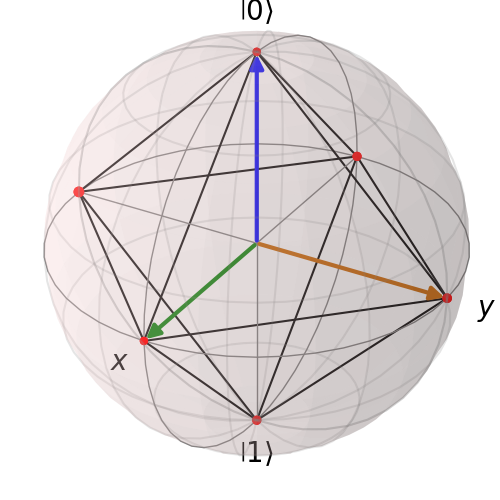
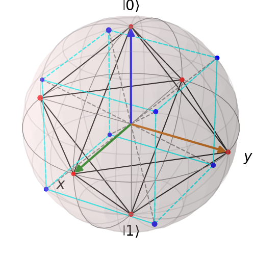
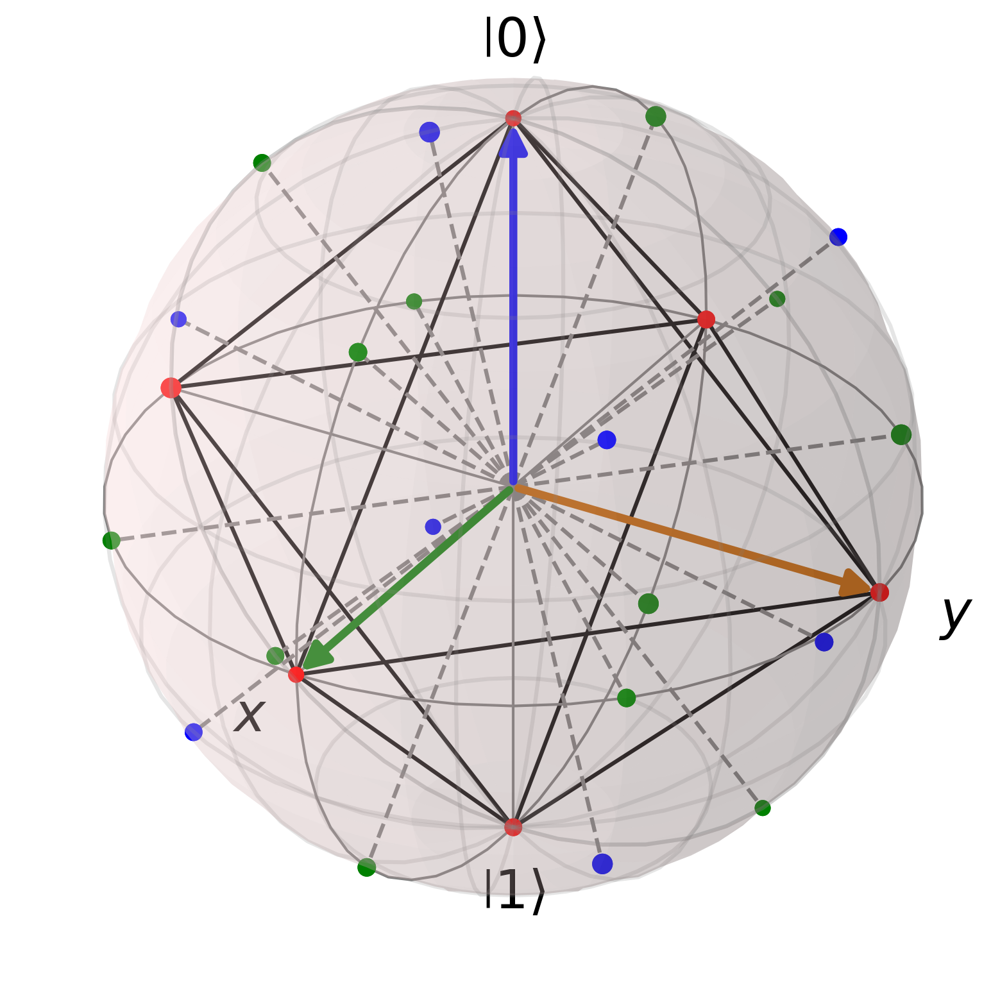

  
# Magic States in Universal Quantum Computer with QuTiP

In a quantum computer, quantum gates can be classified into two categories: *Clifford gates* and *non-Clifford gates*. It separates the gates that are physically easy to implement and simulate classically from those that are physically hard and require the power of quantum mechanics to solve problems efficiently.
What are the Clifford Gates? They are the elements of the Clifford group, a set of mathematical transformations that normalize the n-qubit Pauli group, i.e., map tensor products of Pauli matrices to tensor products of Pauli matrices through conjugation.

If U is a Clifford gate, the conjugation operation

  

where P is a Pauli operator, like X, Y, or Z, always yields another Pauli operator:

  

The three fundamental Clifford gates are the Hadamard (H), Phase (S), and CNOT gates:

  

For example, H is a member of a Clifford group because:

  

Quantum circuits that consist of only Clifford gates can be efficiently simulated with a classical computer due to the Gottesman–Knill theorem, so they are not a universal set of quantum gates.

> Any circuit composed of CNOT, Hadamard, and phase gates can be efficiently simulated on a classical computer, even though such circuits can generate huge amounts of entanglement, and can be used for superdense coding, quantum teleportation, the GHZ paradox, quantum error-correcting codes, etc. - Gottesmann-Knill Theorem, Scott Aaronson Lectures, 008, https://ocw.mit.edu/courses/6-845-quantum-complexity-theory-fall-2010/b50fa65352113b1368ac6e81379c913b_MIT6_845F10_lec23.pdf

To perform arbitrary quantum computations, you need non-Clifford gates. The most common example is a T-gate (π/8 gate or a 45-degree rotation):

  

Adding T to the Clifford group gives a universal set of {H, S, CNOT, T}.
To perform arbitrary, useful quantum algorithms, a quantum computer needs a universal gate set. Most error-correcting codes easily support Clifford gates, but they do not support non-Clifford gates like the T-gate mentioned above, which is necessary for the universal quantum computer. As a solution, non-Clifford gates can be teleported into a circuit using a specifically prepared, non-stabilizer state, a magic state. These states are called magical because they are not stabilizer states and cannot be efficiently created by Clifford circuits alone.

## Stabilizer states
Stabilizer states, known also as Clifford states, are a class of quantum states defined as the +1 eigenstates of a commutative subgroup S (the stabilizer group) of the n-qubit Pauli group (Gₙ), where -I ∉ S and |S|=2ⁿ. Any such state can be reached by applying Clifford group operations (H, S, CNOT) to the initial state

  

This stabilizer formalism provides a highly efficient way to represent and simulate these states classically, as proven by the Gottesman-Knill theorem.
The Pauli group on one qubit, G₁, is the set of operators {±I, −pm iI, ±X, ± iX, ±Y, ± iY, ±Z, ± iZ} under matrix multiplication, where

  

  

The stabilizers of a state form the stabilizer group S, which is an abelian subgroup of the n-qubit Pauli group Gₙ. Conversely, any abelian subgroup of Gₙ that does not contain -I uniquely defines a stabilizer state. We explicitly exclude -I  from the stabilizer group because if -I were a stabilizer, the only solution to the eigenvalue equation −I |ψ⟩ = |ψ⟩ would be the zero vector, which is not a valid physical state.

In a single-qubit system, stabilizer states correspond to the six vertices of an octahedron inscribed within the Bloch sphere. These are the eigenstates of the Pauli matrices: |0⟩ and |1⟩ (poles, Z-axis), |+⟩ and |−⟩ (X-axis) and |+i⟩ and |−i⟩ (Y-axis). While a general quantum state can exist anywhere on the sphere's surface, Clifford group operations act as rotational symmetries of this octahedron, moving states only between these six cardinal positions. Applying Clifford gates to a stabilizer state results in a discrete walk between these vertices (six points on the sphere), never landing on the points in between.

  
  
 The Bloch sphere with the qubit stabilizer octahedron. 6 red points are 6 stabilizer states.

##  Non-stabilizer states

Non-stabilizer states are any states located outside the six vertices of this octahedron on the Bloch sphere. Among these, Magic States (such as H-type or T-type) are critical because they are necessary for universal, fault-tolerant quantum computation. While the vertices represent the six Pauli eigenstates (the stabilizer states), the octahedron itself consists of 8 triangular faces and 12 distinct edges. Any state that lies on these faces or edges - or anywhere else on the sphere's surface that is not a vertex - is a non-stabilizer state. Injecting these Magic States into a circuit is what allows a quantum computer to move beyond classical simulation and achieve a quantum advantage.

>  For most quantum error correction architectures, gates of the Clifford group are much simpler to implement, often using transversal operations, than their non-Clifford counterparts. - What are magic states?, Daniela Angulo, https://pennylane.ai/qml/demos/tutorial_magic_states

In an error-correcting code, one logical qubit is made up of many physical qubits. An operation is transversal if you can perform a logical gate by applying the corresponding physical gate to each physical qubit independently, without any interaction between qubits within the same block. If you want to perform a CNOT between Logical Qubit A and Logical Qubit B, you apply a physical CNOT between the 1st physical qubit of A and the 1st physical qubit of B, then the 2nd of A and the 2nd of B, and so on. Crucially, physical qubits within Block A never talk to each other during the process. If one physical qubit in Block A fails, that error can only spread to one physical qubit in Block B. Since the code is designed to handle a few isolated errors, the system stays protected.

Clifford gates, such as Hadamard, Phase, and CNOT, act by rotating the axes of the Bloch sphere by increments of π/2 (90°). Because the stabilizer states are the six points where these axes meet the sphere's surface, rotating the sphere by 90° (or 180°) permutes these points. Consequently, the stabilizer states form a closed set under Clifford operations; they are geometrically locked to the vertices of the octahedron and can never leak into the faces or edges without a non-Clifford gate.

The T-states are Magic States geometrically associated with the eight faces (facets) of the stabilizer octahedron. They are essentially the normal projections from the origin through the center of the eight triangular faces. Since an octahedron has eight faces, there are eight distinct T-state families. Because these states lie at the points furthest from any vertex, they cannot be reached by 90° Clifford rotations, making them the essential fuel for non-classical quantum computation.

  
  
  
 There are 8 (blue points) T-type magic states as 8 faces of the octahedron. The coordinates correspond to the 8 corners of a Cube centered at the origin, normalized so they sit on the surface of the Bloch sphere. Since the coordinates ±(1, 1, 1) have a length of √3, we must divide by √3 to normalize them. The general formula for points' coordinates is (±1/√3, ±1/√3, ±1/√3) (and all permutations).

While stabilizer states occupy the vertices, the H-states (H-type Magic States) are geometrically associated with the 12 edges of the stabilizer octahedron. In the context of Magic State Distillation (MSD) and error correction, these states define positions along the lunge-branches, the paths between the cardinal axes. While T-magic aligns with the eight corners of the dual cube (the faces), the H-structures align with the 12 midpoints of the octahedron's edges. In the broader state space, these H-structures define the geometry of the sphere surrounding the octahedron, filling the gap between the easy stabilizer points and the high-magic T-states.

  
  
 There are 12 (green points) H-states. These are the Vertices of the Cuboctahedron. The general formula for points' coordinates is (± 1/√2, ± 1/√2, 0) (and all permutations).

