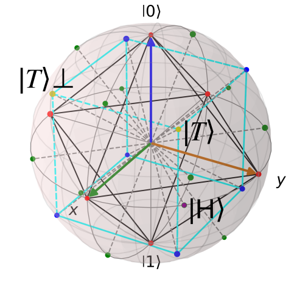

  
# Magic States in Universal Quantum Computer with QuTiP

In a quantum computer, quantum gates can be classified into two categories: *Clifford gates* and *non-Clifford gates*. It separates the gates that are physically easy to implement and simulate classically from those that are physically hard and require the power of quantum mechanics to solve problems efficiently.
What are the Clifford Gates? They are the elements of the Clifford group, a set of mathematical transformations that normalize the n-qubit Pauli group, i.e., map tensor products of Pauli matrices to tensor products of Pauli matrices through conjugation.

If U is a Clifford gate, the conjugation operation

  

where P is a Pauli operator, like X, Y, or Z, always yields another Pauli operator:

  

The three fundamental Clifford gates are the Hadamard (H), Phase (S), and CNOT gates:

  

For example, H is a member of a Clifford group because:

  

Quantum circuits that consist of only Clifford gates can be efficiently simulated with a classical computer due to the Gottesman–Knill theorem, so they are not a universal set of quantum gates.

> Any circuit composed of CNOT, Hadamard, and phase gates can be efficiently simulated on a classical computer, even though such circuits can generate huge amounts of entanglement, and can be used for superdense coding, quantum teleportation, the GHZ paradox, quantum error-correcting codes, etc. - Gottesmann-Knill Theorem, Scott Aaronson Lectures, 008, https://ocw.mit.edu/courses/6-845-quantum-complexity-theory-fall-2010/b50fa65352113b1368ac6e81379c913b_MIT6_845F10_lec23.pdf

To perform arbitrary quantum computations, you need non-Clifford gates. The most common example is a T-gate (π/8 gate or a 45-degree rotation):

  

Adding T to the Clifford group gives a universal set of {H, S, CNOT, T}.
To perform arbitrary, useful quantum algorithms, a quantum computer needs a universal gate set. Most error-correcting codes easily support Clifford gates, but they do not support non-Clifford gates like the T-gate mentioned above, which is necessary for the universal quantum computer. As a solution, non-Clifford gates can be teleported into a circuit using a specifically prepared, non-stabilizer state, a magic state. These states are called magical because they are not stabilizer states and cannot be efficiently created by Clifford circuits alone.

## Stabilizer states
Stabilizer states, known also as Clifford states, are a class of quantum states defined as the +1 eigenstates of a commutative subgroup S (the stabilizer group) of the n-qubit Pauli group (Gₙ), where -I ∉ S and |S|=2ⁿ. Any such state can be reached by applying Clifford group operations (H, S, CNOT) to the initial state

  

This stabilizer formalism provides a highly efficient way to represent and simulate these states classically, as proven by the Gottesman-Knill theorem.
The Pauli group on one qubit, G₁, is the set of operators {±I, −pm iI, ±X, ± iX, ±Y, ± iY, ±Z, ± iZ} under matrix multiplication, where

  

  

The stabilizers of a state form the stabilizer group S, which is an abelian subgroup of the n-qubit Pauli group Gₙ. Conversely, any abelian subgroup of Gₙ that does not contain -I uniquely defines a stabilizer state. We explicitly exclude -I  from the stabilizer group because if -I were a stabilizer, the only solution to the eigenvalue equation −I |ψ⟩ = |ψ⟩ would be the zero vector, which is not a valid physical state.

In a single-qubit system, stabilizer states correspond to the six vertices of an octahedron inscribed within the Bloch sphere. These are the eigenstates of the Pauli matrices: |0⟩ and |1⟩ (poles, Z-axis), |+⟩ and |−⟩ (X-axis) and |+i⟩ and |−i⟩ (Y-axis). While a general quantum state can exist anywhere on the sphere's surface, Clifford group operations act as rotational symmetries of this octahedron, moving states only between these six cardinal positions. Applying Clifford gates to a stabilizer state results in a discrete walk between these vertices (six points on the sphere), never landing on the points in between.

  
  
 The Bloch sphere with the qubit stabilizer octahedron. 6 red points are 6 stabilizer states.

##  Non-stabilizer states

Non-stabilizer states are any states located outside the six vertices of this octahedron on the Bloch sphere. Among these, Magic States (such as H-type or T-type) are critical because they are necessary for universal, fault-tolerant quantum computation. While the vertices represent the six Pauli eigenstates (the stabilizer states), the octahedron itself consists of 8 triangular faces and 12 distinct edges. Any state that lies on these faces or edges - or anywhere else on the sphere's surface that is not a vertex - is a non-stabilizer state. Injecting these Magic States into a circuit is what allows a quantum computer to move beyond classical simulation and achieve a quantum advantage.

>  For most quantum error correction architectures, gates of the Clifford group are much simpler to implement, often using transversal operations, than their non-Clifford counterparts. - What are magic states?, Daniela Angulo, https://pennylane.ai/qml/demos/tutorial_magic_states

In an error-correcting code, one logical qubit is made up of many physical qubits. An operation is transversal if you can perform a logical gate by applying the corresponding physical gate to each physical qubit independently, without any interaction between qubits within the same block. If you want to perform a CNOT between Logical Qubit A and Logical Qubit B, you apply a physical CNOT between the 1st physical qubit of A and the 1st physical qubit of B, then the 2nd of A and the 2nd of B, and so on. Crucially, physical qubits within Block A never talk to each other during the process. If one physical qubit in Block A fails, that error can only spread to one physical qubit in Block B. Since the code is designed to handle a few isolated errors, the system stays protected.

Clifford gates, such as Hadamard, Phase, and CNOT, act by rotating the axes of the Bloch sphere by increments of π/2 (90°). Because the stabilizer states are the six points where these axes meet the sphere's surface, rotating the sphere by 90° (or 180°) permutes these points. Consequently, the stabilizer states form a closed set under Clifford operations; they are geometrically locked to the vertices of the octahedron and can never leak into the faces or edges without a non-Clifford gate.

The T-states are Magic States geometrically associated with the eight faces (facets) of the stabilizer octahedron. They are essentially the normal projections from the origin through the center of the eight triangular faces. Since an octahedron has eight faces, there are eight distinct T-state families. Because these states lie at the points furthest from any vertex, they cannot be reached by 90° Clifford rotations, making them the essential fuel for non-classical quantum computation.

  
  
  
 There are 8 (blue points) T-type magic states as 8 faces of the octahedron. The coordinates correspond to the 8 corners of a Cube centered at the origin, normalized so they sit on the surface of the Bloch sphere. Since the coordinates ±(1, 1, 1) have a length of √3, we must divide by √3 to normalize them. The general formula for points' coordinates is (±1/√3, ±1/√3, ±1/√3) (and all permutations).

While stabilizer states occupy the vertices, the H-states (H-type Magic States) are geometrically associated with the 12 edges of the stabilizer octahedron. In the context of Magic State Distillation (MSD) and error correction, these states define positions along the lunge-branches, the paths between the cardinal axes. While T-magic aligns with the eight corners of the dual cube (the faces), the H-structures align with the 12 midpoints of the octahedron's edges. In the broader state space, these H-structures define the geometry of the sphere surrounding the octahedron, filling the gap between the easy stabilizer points and the high-magic T-states.

  
  
 There are 12 (green points) H-states. These are the Vertices of the Cuboctahedron. The general formula for points' coordinates is (± 1/√2, ± 1/√2, 0) (and all permutations).

Standard Clifford unitary gates function as rotations within the SO(3) group (the Special Orthogonal group of 3D rotations). These operations preserve the handedness of the stabilizer octahedron, meaning they rotate it without any flipping or mirroring. However, the full stabilizer formalism, which includes the Pauli group (with phases like −1) and the operation of complex conjugation, introduces anti-unitary transformations. Complex conjugation effectively inverts the sign of the imaginary components, acting as a reflection symmetry (mirroring). This expands the symmetry group of the octahedron beyond simple rotations to include reflections, effectively allowing the octahedron to be flipped or mirrored in state space.

##  Magic States
Magic States are specific input states that serve as a seed/resource to enable non-Clifford operations. In the Discrete Variable (DV) domain, these are qubit-based states, while in the Continuous Variable (CV) or bosonic domain, they are non-Gaussian states. However, there is significant inconsistency in academic literature regarding the naming of T- and H-states [5]. A standard definition for the H-type state is |H⟩ = T|+⟩, which is produced by applying a T-gate to the |+⟩ stabilizer state [7]:

  

where

  

This |H⟩-state has a relative phase exp(iπ/4), which corresponds to a vector on the equator (the XY plane) of the Bloch sphere, rotated by ϕ = π/4 (45°) from the X-axis. This is the most commonly distilled state, typically produced through protocols involving the 7-qubit Steane code or the [[5,1,3]] codes. It is important to note that T|+⟩ is mathematically equivalent to√T|0⟩ up to a Clifford correction.

The magic T-states are  the eigenvectors of the operator

  

where a gate H is followed by the S gate. In the computational basis, these eigenvectors can be expressed as given in [8]:

  

T_state

  

The orthogonal to this state is :

  

  
  
 |H⟩-state is shown as a purple point ([1/√2, 1/√2, 0.0]), |𝑇⟩ ([1/√3, 1/√3, 1/√3]) and |𝑇⟩⊥ ([1/√3, −1/√3, 1/√3])-states are shown as the yellow points

Because the T-gate belongs to the third level of the Clifford hierarchy, it cannot be implemented as a simple transversal operation in most standard codes. Instead, it requires specialized distillation protocols. A primary example is the [[5,1,3]] code, the smallest perfect code used to protect quantum data from Pauli errors. However, even this code requires Magic State Distillation to inject Level 3 operations. In contrast, more complex codes like the 15-qubit Reed-Muller code are specifically designed with the mathematical structure needed to handle these Level 3 gates transversally, highlighting the fundamental trade-off between code size and gate complexity.

>  The Clifford hierarchy is a nested sequence of sets of quantum gates that can be fault-tolerantly performed using gate teleportation within standard
quantum error correction schemes. The groups of Pauli and Clifford gates constitute the first and second levels, respectively. Non-Clifford gates from
the third level or higher, such as the T-gate, are necessary for achieving fault-tolerant universal quantum computation. - The Clifford hierarchy for one qubit or qudit, https://royalsocietypublishing.org/rspa/article/481/2324/20250035/234359/The-Clifford-hierarchy-for-one-qubit-or-quditThe, [9]

Higher-order magic refers to quantum states that enable non-Clifford unitaries deeper in the Clifford hierarchy. The T-gate belongs to the third level of this hierarchy, with the |T⟩-state serving as the archetypal Magic State required for its implementation. Similarly, the CCZ (and the Toffoli) gates also reside in the third level, enabling the complex logical branching necessary for universal computation. While both T and CCZ gates share the same hierarchical level, CCZ states represent a higher resource cost. A single CCZ gate effectively synthesizes the power of multiple T-gates (traditionally, a CCZ or Toffoli requires 4 to 7 T-gates to construct). Consequently, certain fault-tolerant schemes prioritize the direct distillation of these multi-qubit Magic States to optimize the space-time volume of the quantum circuit, despite the more stringent fidelity requirements involved.

Magic |M⟩-state

  

is the Hadamard-rotated T-state (H|T⟩) and is locally Clifford-equivalent to the |H⟩ state. Applying a Hadamard gate maps the state such that H∣M⟩∝∣0⟩+exp(iπ/4)∣1⟩, effectively rotating the magic resource into the X-basis. So |M⟩ is simply the |H⟩ state rotated into the X-basis. This |M⟩-state is frequently utilized in GKP-encoded (Gottesman-Kitaev-Preskill) or bosonic protocols because specific gate teleportation routines require the ancilla to be prepared in the X-basis rather than the Z-basis. On the Bloch sphere, while the |H⟩-state typically lies on the equator (Z = 0), the |M⟩-state's Bloch vector points in the YZ-plane at a 45° angle to the Y-axis, with coordinates [0, -1/√2, 1/√2].

The notion of magic can be generalized beyond a single-qubit state. The CCZ-state is a three-qubit magic state that enables the doubly-controlled-Z (CCZ) gate through gate teleportation:

  

Explicitly,

  

While the T-state provides the non-Clifford kick for a single qubit, the CCZ-state provides the multi-qubit entanglement and phase-shift necessary for Toffoli-class operations. Within the Clifford hierarchy, the CCZ-state remains a Level 3 resource, but it is considered richer than a T-state because it can be used to synthesize several T-gates, making it a highly efficient resource for complex logical circuits.

In the computational basis, every term of the CCZ state has a positive coefficient (+1) except for the |111⟩ term, which has a negative coefficient (-1). This specific phase pattern, a relative phase of -1 isolated on a single basis state, cannot be produced by Clifford gates alone. Because the CCZ state is a non-stabilizer state, it contains the magic resource required to perform non-Clifford operations. The CCZ gate is closely related to the Toffoli gate (CCNOT). While the CCZ applies a Z-gate to the target qubit if both controls are 1, the Toffoli applies an X-gate. Mathematically, they are Clifford-equivalent, as one can be transformed into the other simply by applying a Hadamard gate H to the target qubit:

  

Therefore, possessing a |CCZ⟩ Magic State allows you to perform either a CCZ-gate or a Toffoli gate (which are equivalent up to surrounding Clifford Hadamards) via a process called gate teleportation. By consuming this pre-distilled Magic State, a quantum processor can execute complex logical branching and AND-gate operations without needing to perform the non-Clifford rotation directly on the data qubits, effectively bypassing the limitations of the stabilizer formalism.

In quantum error correction, a fundamental trade-off exists between generic single-qubit Magic States and specialized multi-qubit resources. Constructing a Toffoli gate using only single-qubit T-states typically requires between 4 and 7 T-gates plus additional Clifford operations. In contrast, injecting a specialized, higher-order |CCZ⟩ state allows the entire operation to be performed in a single step via gate teleportation. While |CCZ⟩ states require larger and more complex distillation factories, directly distilling them is often more efficient in terms of qubit count and circuit depth. This is particularly advantageous for algorithms that rely heavily on Toffoli gates, such as quantum arithmetic or the implementation of Oracles.

The Jupyter Notebook for Magic State Injection and Magic State Distillation codes in QuTip is here:

# References

[1] Qutrit magic state distillation, https://iopscience.iop.org/article/10.1088/1367-2630/14/6/063006

[2] QUANTUM UNIVERSALITY BY STATE DISTILLATION,  https://www.rintonpress.com/xxqic9/qic-9-1112/1030-1052.pdf

[3] Quantification and manipulation of magic states, Mehdi Ahmadi, Hoan Bui Dang, Gilad Gour, Barry C. Sanders, https://arxiv.org/abs/1706.03828

[4] Stabilizers and Simulating Entanglement, https://www.dna.caltech.edu/cbsss/finalreport/entanglement_howard.pdf

[5] Definition of magic T and H states: are there different definitions for them? https://quantumcomputing.stackexchange.com/questions/21172/definition-of-magic-t-and-h-states-are-there-different-definitions-for-them

[6] Why are there eight T magic states and twelve H magic states? https://quantumcomputing.stackexchange.com/questions/21113/why-are-there-eight-t-magic-state-and-twelve-h-magic-states/21119#21119

[7] What are magic states? https://pennylane.ai/qml/demos/tutorial_magic_states

[8] Magic state distillation, https://pennylane.ai/qml/demos/tutorial_magic_state_distillation

[9] The Clifford hierarchy for one qubit or qudit, https://royalsocietypublishing.org/rspa/article/481/2324/20250035/234359/The-Clifford-hierarchy-for-one-qubit-or-quditThe

[10] Universal quantum computation by Clifford gates plus magic state, https://quantumcomputing.stackexchange.com/questions/23815/universal-quantum-computation-by-clifford-gates-plus-magic-state

[12] Experimental demonstration of logical magic state distillation, Pedro Sales Rodriguez et al., https://arxiv.org/pdf/2412.15165

[13] Sergey Bravyi and Alexei Kitaev. Universal quantum computation with ideal Clifford gates and noisy ancillas, Physical Review A, 71(2):022316, 2005

[14] Experimental demonstration of logical magic state distillation, Pedro Sales Rodriguez, https://www.researchgate.net/publication/387264728_Experimental_Demonstration_of_Logical_Magic_State_Distillation

[15] 'Magic' states empower error-resistant quantum computing, Emily Conover, https://www.sciencenews.org/article/magic-error-quantum-computing

[16] Can you walk us through the significance of demonstrating a fully fault-tolerant universal gate set with repeatable error correction? Shival Dasu, https://www.azoquantum.com/Article.aspx?ArticleID=624

[17] Breaking even with magic: demonstration of a high-fidelity logical non-Clifford gate, Shival Dasu et al., https://arxiv.org/abs/2506.14688

[18] Experimental Demonstration of High-Fidelity Logical Magic States from Code Switching, Lucas Daguerre et al., https://arxiv.org/pdf/2506.14169
